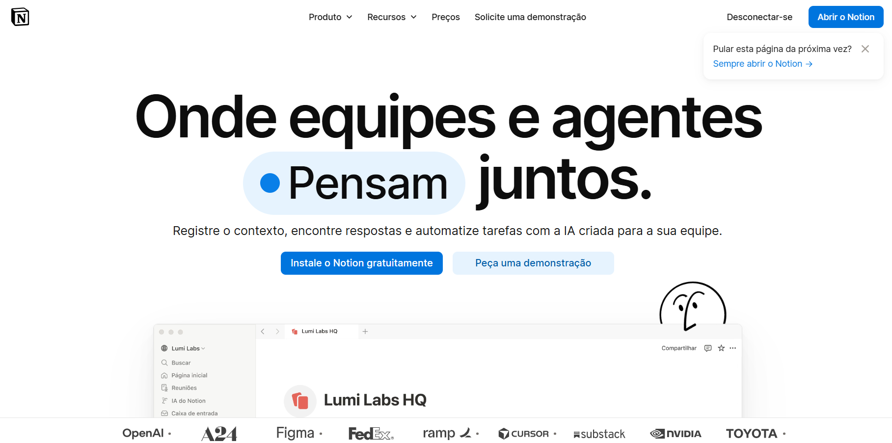
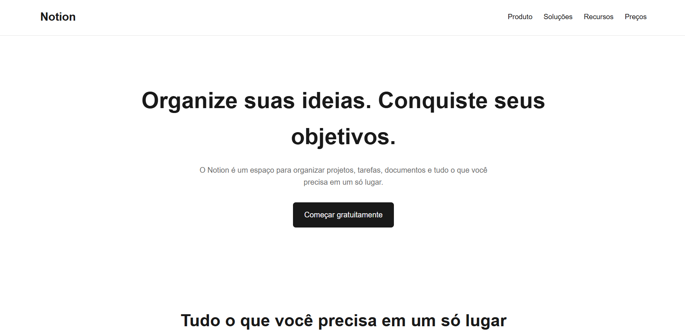

# Projeto Front-End - Notion

## Identificação

**Nome:** Adrian Lemos  
**Matrícula:** 1139696

## Página de referência

Este projeto foi desenvolvido tendo como referência visual a página oficial do Notion:

https://www.notion.com/pt

A proposta foi desenvolver uma página inspirada na organização visual do Notion,
utilizando HTML semântico, CSS e JavaScript básico.

O projeto foi desenvolvido de forma própria, sem copiar o código-fonte da
página original.

---

# Checklist da Parte 1

## 1.1 - Estrutura HTML semântica e acessível

- [x] Uso de tags semânticas
- [x] Imagens com atributo `alt`
- [x] Formulário acessível e funcional

### Implementação

Foram utilizadas tags semânticas para organizar a estrutura da página, como:

- `<header>` para o cabeçalho;
- `<nav>` para a navegação;
- `<main>` para o conteúdo principal;
- `<section>` para separar as diferentes áreas da página;
- `<article>` para os cards de recursos;
- `<footer>` para o rodapé.

O projeto não utiliza imagens externas dentro da página. Por isso, não existem
imagens no conteúdo do site que necessitem do atributo `alt`.

Foi criado um formulário de contato com campos para nome, e-mail e mensagem.
Cada campo possui um `<label>` associado ao respectivo campo de formulário.

O formulário também possui uma interação em JavaScript que apresenta a mensagem
"Mensagem enviada com sucesso!" após o envio.

---

## 1.2 - Fidelidade visual à referência

- [x] Organização geral semelhante à referência
- [x] Cores e espaçamentos inspirados na referência
- [x] Cabeçalho, conteúdo principal e rodapé
- [x] Diferenças justificadas

### Implementação

A página foi desenvolvida buscando manter uma organização visual simples e
minimalista, inspirada na página de referência do Notion.

Foram utilizados elementos visuais como:

- fundo claro;
- textos em tons escuros;
- elementos em tons de cinza;
- botão de destaque;
- cards para organização dos conteúdos;
- espaçamentos entre as seções;
- cabeçalho com navegação;
- rodapé ao final da página.

Algumas diferenças foram realizadas para adaptar a página ao objetivo
acadêmico e aos requisitos do projeto.

Também foram adicionados elementos próprios, como o formulário de contato e
a seção "Sobre este projeto".

### Comparação visual

Abaixo está a comparação entre a página utilizada como referência e o
resultado desenvolvido neste projeto.

| Página de referência | Projeto desenvolvido |
|---|---|
|  |  |

---

## 1.3 - CSS: seletores, Box Model e variáveis

- [x] Utilização de diferentes tipos de seletores
- [x] Utilização do Box Model
- [x] Utilização de variáveis CSS

### Implementação

Foram utilizados diferentes tipos de seletores CSS.

Exemplos:

**Seletor de elemento:**

```css
body {
    font-family: Arial, sans-serif;
}
```

**Seletor descendente:**

```css
form label {
    display: block;
}
```

**Pseudo-classe:**

```css
nav a:hover {
    color: var(--cor-destaque);
}
```

Também foram utilizados seletores mais específicos, como:

```css
main > section:nth-child(2)
```

O Box Model foi utilizado em diversos elementos através de propriedades como:

- `margin`;
- `padding`;
- `border`;
- `width`;
- `box-sizing`.

Foram criadas variáveis CSS dentro de `:root` para facilitar a manutenção
das cores utilizadas no projeto.

Exemplo:

```css
:root {
    --cor-fundo: #ffffff;
    --cor-texto: #191919;
    --cor-cinza: #6b6b6b;
    --cor-borda: #e5e5e5;
    --cor-destaque: #2383e2;
    --cor-card: #f7f7f5;
}
```

---

## 1.4 - Responsividade: Flexbox, Grid e Mobile First

- [x] Desenvolvimento Mobile First
- [x] Utilização de Flexbox
- [x] Utilização de CSS Grid
- [x] Media query com `min-width`
- [x] Teste em telas menores e maiores

### Implementação

O CSS foi desenvolvido seguindo a abordagem Mobile First.

Na configuração inicial, os elementos são organizados para funcionar em
telas menores, sem depender de uma media query.

O Flexbox foi utilizado principalmente no cabeçalho e na navegação.

Exemplo:

```css
header {
    display: flex;
    flex-direction: column;
}
```

O CSS Grid foi utilizado na seção dos cards.

Em telas menores:

```css
grid-template-columns: 1fr;
```

Dessa forma, os cards ficam organizados um abaixo do outro.

Para telas maiores foi utilizada uma media query:

```css
@media (min-width: 768px) {
    main > section:nth-child(2) {
        grid-template-columns: repeat(3, 1fr);
    }
}
```

Assim, em telas maiores os três cards ficam lado a lado.

Também foram realizados testes alterando o tamanho da janela do navegador para
verificar o comportamento da página em diferentes tamanhos de tela.

---

## 1.5 - Personalização e originalidade

- [x] Inclusão de elementos próprios

### Implementação

Além da inspiração visual no Notion, foram adicionados elementos próprios ao
projeto.

Entre eles:

- formulário de contato funcional;
- mensagem de confirmação após o envio do formulário;
- seção "Sobre este projeto";
- identificação do desenvolvedor;
- efeitos de interação nos cards;
- botão "Começar gratuitamente" direcionando para o formulário;
- adaptação responsiva própria.

Esses elementos foram utilizados para personalizar o projeto e demonstrar
conhecimentos de HTML, CSS e JavaScript.

---

# Tecnologias utilizadas

- HTML5
- CSS3
- JavaScript
- Git
- GitHub

---

# Estrutura do projeto

```text
G1- FrontEnd/
│
├── prints/
│   ├── Projeto.png
│   └── Referência-notion.png
│
├── index.html
├── style.css
└── README.md
```

---

# Desenvolvedor

**Adrian Lemos**  
**Matrícula:** 1139696

Projeto acadêmico desenvolvido para a disciplina de Front-End.